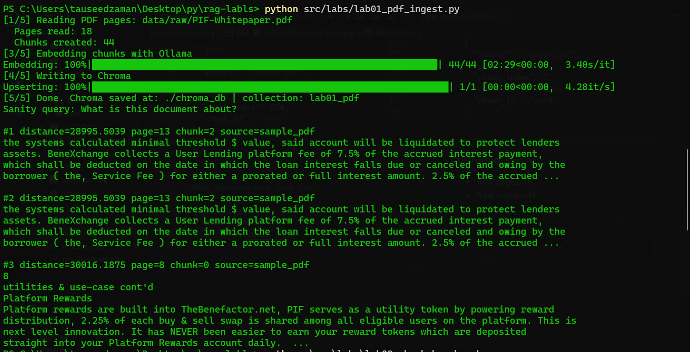

## 🧪 Lab 01 – PDF Ingestion with Metadata

### 🎯 Goal

Build a complete ingestion pipeline from raw PDF to searchable vector database using:

* Chroma (vector DB)
* Ollama (embeddings)
* Recursive chunking
* Page-level metadata

---

### 🏗 Architecture

```
PDF
 ↓
Page Extraction (per page metadata too)
 ↓
Cleaning
 ↓
Chunking (with overlap)
 ↓
Embedding (Ollama)
 ↓
Chroma (id + embedding + metadata)
 ↓
Similarity Query
 ↓
Top-K Retrieval
```

---

### 📚 Key Learnings

1. **RAG is retrieval engineering first**
2. Page-level metadata enables traceability & citations
3. Chunk size and overlap are controllable variables
4. Embeddings are deterministic semantic vectors
5. Vector DB = structured storage + similarity math
6. Retrieval happens before generation

---

### 📦 Stored Metadata Example

```json
{
  "source": "sample_pdf",
  "page": 12,
  "chunk_index": 3,
  "chunk_chars": 824,
  "chunk_id": "uuid"
}
```

---

#### Observations from run:

