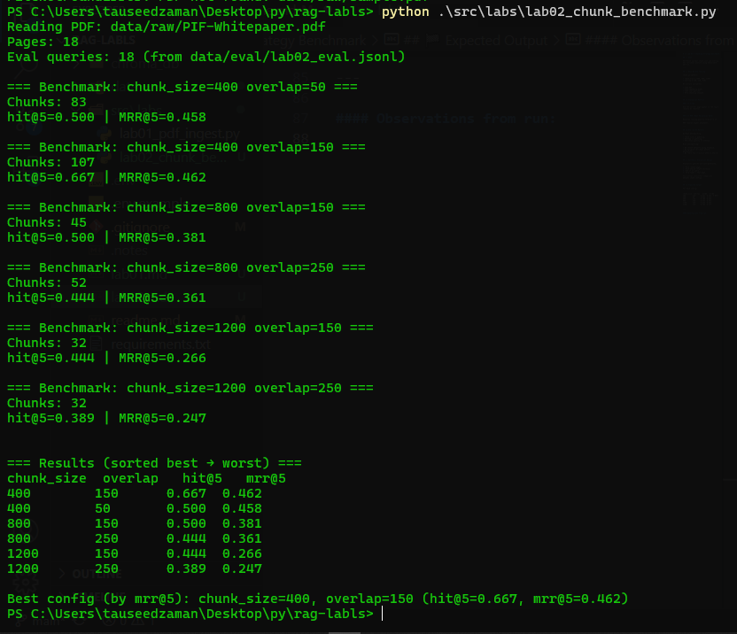

# 🧪 Lab 02 – Chunking Strategy Benchmark

## 🎯 Goal

Determine optimal chunk size and overlap for retrieval quality using measurable metrics.

---

## 🔬 What We Are Testing

Chunk parameters:

* chunk_size ∈ {400, 800, 1200}
* overlap ∈ {50, 150, 250}

We isolate variables:

* Same PDF
* Same embedding model
* Same eval queries
* Only chunking changes

---

## 📊 Evaluation Metrics

### 1️⃣ hit@k

Did the correct page appear in the top k (mostly 5) results?

---

### 2️⃣ MRR (Mean Reciprocal Rank)

Measures ranking quality (from 0 to 1).

MRR rewards higher placement.

---

## 🧠 Why Lab 02 Matters

Without benchmarking:

* Chunk size is guessing.
* Overlap is guessing.
* Retrieval quality is unknown.

With benchmarking:

* We choose defaults using evidence.
* We optimize retrieval before generation.
* We learn how structure affects search.

---

## 🔎 Synthetic Evaluation Design

Evaluation queries are auto-generated:

1. Pick random page.
2. Pick medium-length sentence.
3. Use it as query.
4. Gold label = that page.

This allows consistent comparison between chunk configs.

---

## 🏁 Expected Output

For each config:

```
chunk_size  overlap   hit@5   mrr@5
400        150      0.667  0.462  ← Best
400        50       0.500  0.458
800        150      0.500  0.381
800        250      0.444  0.361
1200       150      0.444  0.266
1200       250      0.389  0.247
```

---

#### Observations from run:
